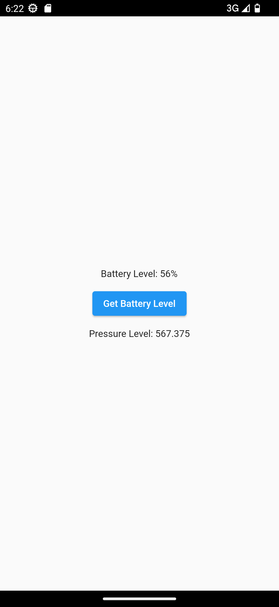
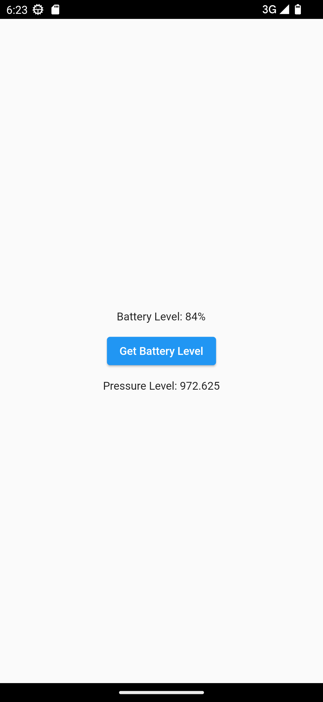

# Flutter Platform Channel

### Platform channel implementation in a simple app

This is a simple app that updates the current battary level upon clicking on a button, and shows the barometer pressure level

The battery level is shown using methods(method channel)  
The pressure level is shown using stream(event channel)

 
 

## Features

- Battery Percentage
- Barometer Reading

 
 

## Showcase

<table>
  <tr>
    <td></td>
    <td></td>
  </tr>
 </table>
 

 

## Stacks

- Dart
- Flutter
- Java

 

## Topics

- Platform Channel
- Method Channel
- Event Channel
- Native android

 

## Topics to have a look
- Native Android
- Method channel and Event channel
- Use case and usage of platform code in flutter

 

## Packages and dependencies

N/A

## Q/A
N/A

## Issues
N/A